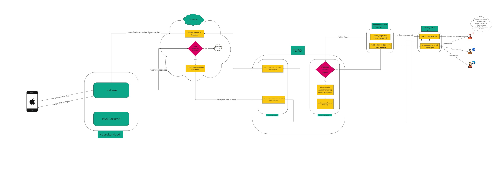

# 🔁 SyncFusion Microservice

**SyncFusion** is a scalable, robust microservice designed to synchronize discussions between an internal online forum and external email threads. It enables seamless **bi-directional sync** between email and web-based conversation platforms with high reliability, fault-tolerance, and performance.

---

## 🚀 Functionality

- 📨 **Bi-directional Synchronization**  
  Automatically syncs content between the forum and email threads in near real-time.

- 🔐 **Secure Auth & Access Control**  
  Authenticates all email requests and forum actions to ensure data integrity.

- ⚡ **High Throughput Messaging**  
  Optimized for performance under high message volume using asynchronous processing.

- 💬 **De-duplication & Idempotency**  
  Ensures messages are not duplicated or re-processed using smart caching + locks.

---

# Architecture and Request Flow


## 🏗️ Tech Stack

| Layer       | Tech Used                     |
|------------|-------------------------------|
| Language    | Java, Spring Boot             |
| Messaging   | Kafka                         |
| Database    | MySQL                         |
| Caching     | Redis                         |
| Locking     | Redis Distributed Locks       |
| API Layer   | RESTful APIs, gRPC (org-wide) |
| Infra       | Docker, Kubernetes            |

---

## ⚙️ Kafka Implementation

To handle high volume email-forum message exchanges:

- Used **Kafka producers and consumers** to decouple email and forum message flows.
- Implemented **asynchronous message pipelines** to handle spikes in traffic.
- Leveraged **Kafka topic partitions** for horizontal scaling.
- Configured **consumer groups** to parallelize sync logic safely.

🎯 This enabled **non-blocking**, **high-throughput** processing of messages and ensured scalability across multiple instances.

---

## 🛡️ MySQL + Redis for Sync Accuracy

### ✅ MySQL:
- Stores all message metadata persistently
- Tracks sync state between forum ↔️ email for audit and recovery

### ✅ Redis:
- Used as a **cache layer** for fast message state lookups
- Stores **idempotency keys** to **prevent message duplication**
- Applied **Redis Distributed Locks** to avoid race conditions in multi-node sync handling

---

## 🧩 Scalability and Reliability

- Stateless microservice with **horizontal scalability**
- Redis locks + Kafka buffering = **resilient under high concurrency**
- Fail-safe mechanisms for **retry and backoff** in case of downstream failure

---

## 📈 Impact

- 🚀 Improved forum-email engagement by **30%+**
- ⏱️ Reduced sync latency by over **60%**
- 🔒 Achieved **zero message loss** and **idempotent delivery guarantees**

---

## 📁 Project Structure

```
SyncFusion/
├── src/
│   ├── main/
│   │   ├── java/
│   │   │   └── com/syncfusion/
│   │   │       ├── controllers/     # REST API endpoints
│   │   │       ├── services/        # Business logic implementation
│   │   │       ├── kafka/          # Kafka producers and consumers
│   │   │       ├── redis/          # Redis cache and distributed locks
│   │   │       ├── database/       # Database models and repositories
│   │   │       ├── dto/            # Data Transfer Objects
│   │   │       ├── exceptions/     # Custom exception handling
│   │   │       ├── handlers/       # Request/Response handlers
│   │   │       ├── logging/        # Logging configurations
│   │   │       ├── processors/     # Message processing logic
│   │   │       ├── utils/          # Utility classes
│   │   │       ├── cronJobs/       # Scheduled tasks
│   │   │       ├── uniview/        # Uniview integration
│   │   │       └── brahmos/        # Brahmos integration
│   │   └── resources/              # Configuration files and resources
│   └── test/                       # Test classes
├── devops/                         # Deployment and infrastructure
└── README.md
```


